# Visual Map

## Capture Status

This is the visual validation surface for the engagement. **Real screenshots where they exist; clearly
marked WIP placeholders where they do not.** Nothing here is a mockup pretending to be a screen.

> **Note on full-page captures.** Several sources are full-page screenshots many thousands of pixels
> tall (one studio capture is 3243 × 17987). They are stored here **cropped to the top region and
> downscaled to 1400px wide** — which is the part the card actually displays — so the asset set stays
> ~2.4 MB instead of ~85 MB. The uncropped originals remain in the sibling workspace
> (`business/`, `roryskagenart.com/.shots/`, `_archive/history/`).

| Surface | Status |
| :--- | :--- |
| Shop storefront (home, header, gallery) | ✅ Captured |
| Shop `/playground` | ✅ Captured |
| Fourthwall hosted storefront | ✅ Captured |
| Studio archive (light + dark home) | ✅ Captured |
| Studio admin (planning board) | ✅ Captured |
| Studio visual history (`v3.1.0`) | ✅ Captured |
| Brand assets (logo, profile, mural) | ✅ Captured |
| Studio admin — full surface set | ⚠️ **WIP** — 23 frames exist in `_archive/history/v3.1.0/`; only 3 inlined here |
| Shop `/docs` before this brief | ⚠️ **WIP** — no capture committed |
| Excalidraw / architecture diagrams | ⚠️ **WIP** — only ASCII diagrams exist in-repo |

## Shop — Storefront

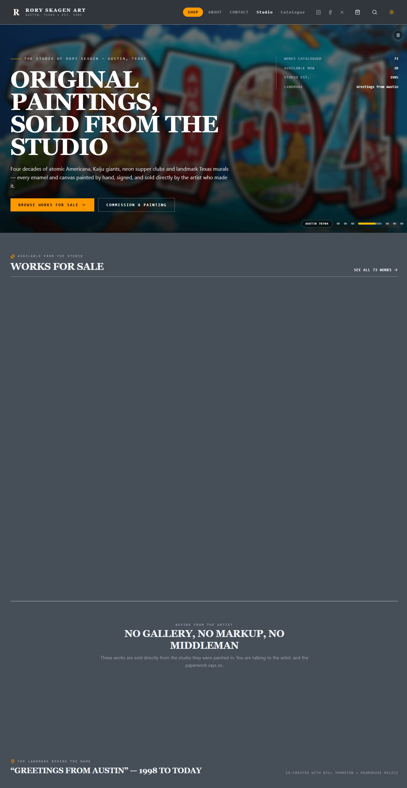
_Home page, top region: hero focus-pull, "Works For Sale", artist statement._

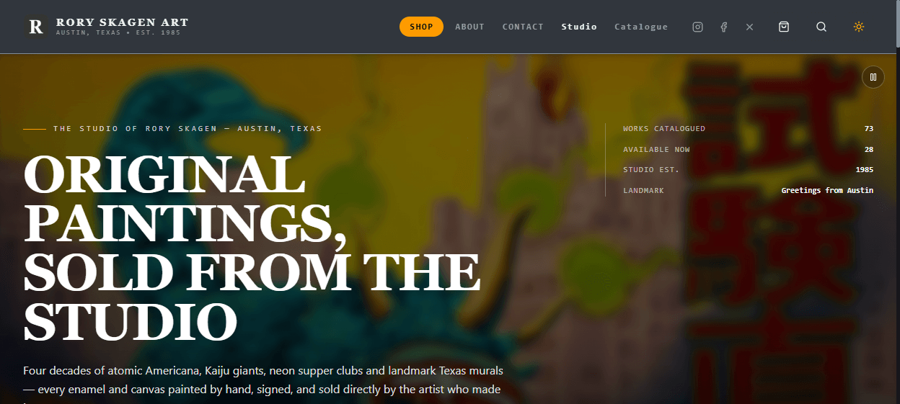
_The two-tier header. Live counters read "73 Works Catalogued / 28 Available Now"._

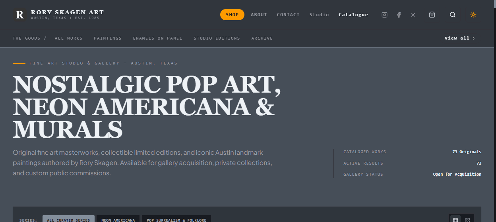
_Gallery surfaces with the series rail and a real filter row._

## Shop — Playground & Product

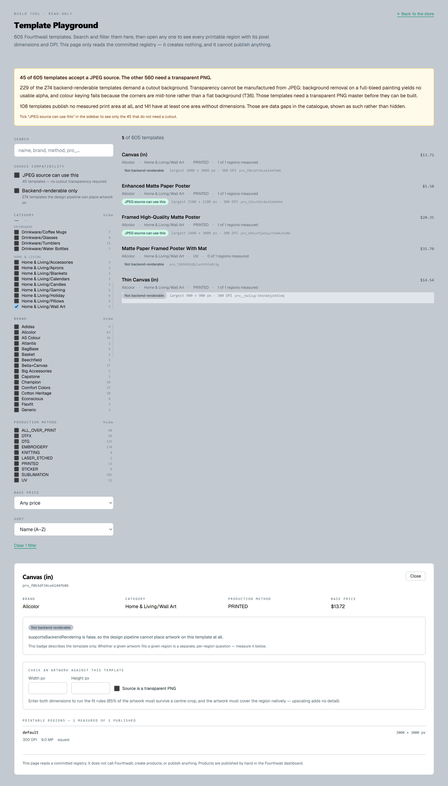
_`/playground`: a read-only template explorer. Note the fidelity banner — only 45 of 605 templates accept
a JPEG source, and 229 need a transparent PNG the artist cannot produce._

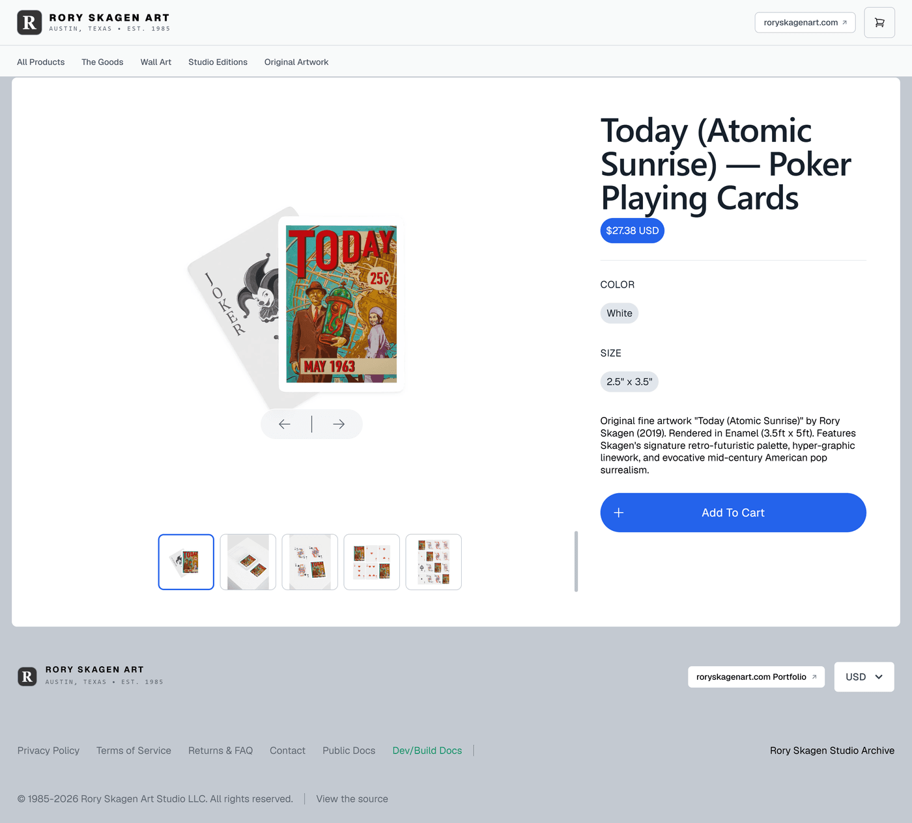
_A purchasable product page in the Skagen dark palette._

## Fourthwall Hosted Surfaces

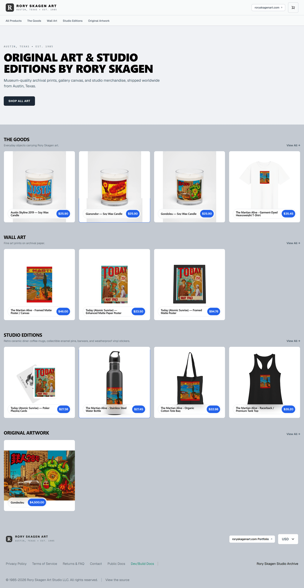
_The vendor-hosted storefront — The Goods · Wall Art · Studio Editions · Original Artwork._

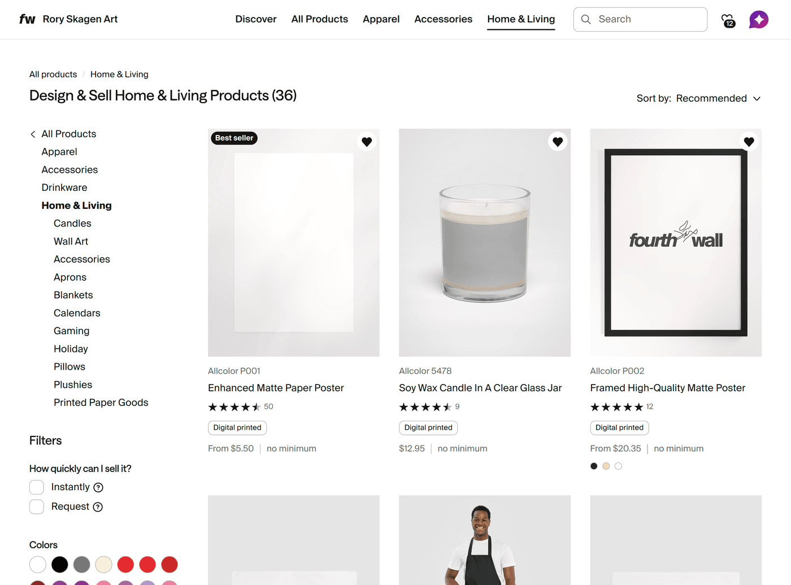
_The 605-template gallery that constrains all merch work._

## Studio Archive

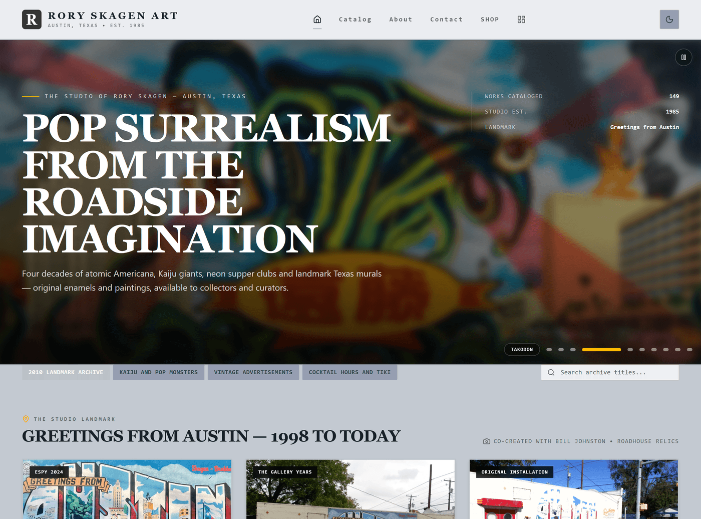
_Studio archive home — fine art, murals, individual works, curated series._

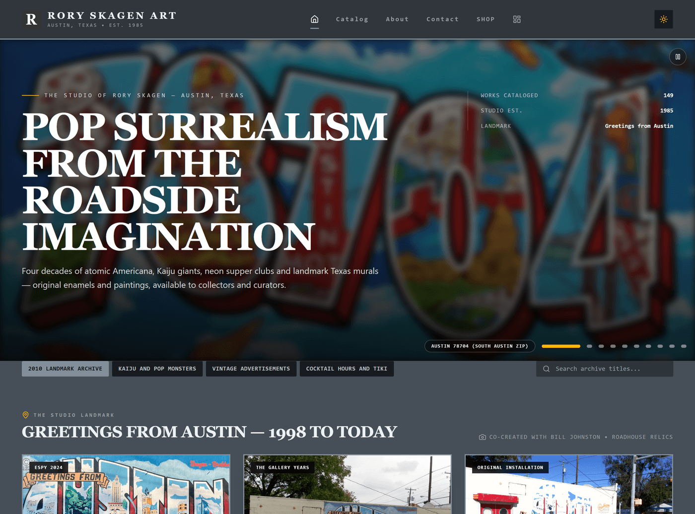
_The same page in the Charcoal Gallery palette._

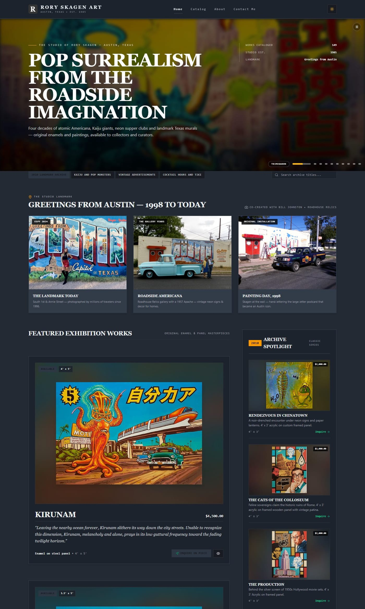
_Frame from the generated visual history at v3.1.0._

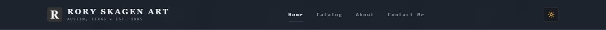
_Element-clipped region: the navbar as captured by the history tool._

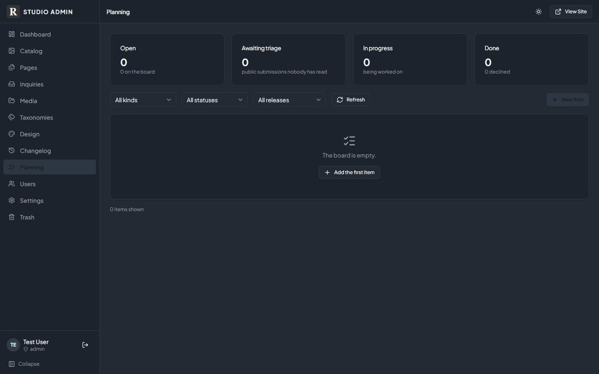
_The authenticated planning board ("Capture") — the studio's own feedback loop._

## Brand Assets


_The wordmark and identity used across both properties._

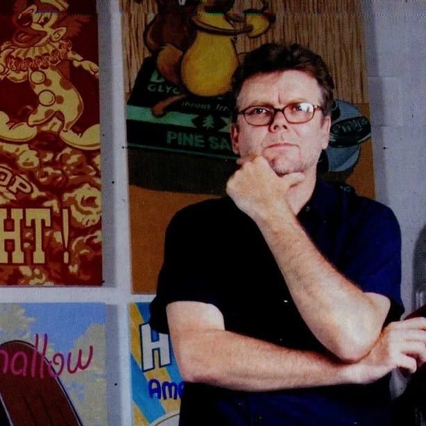
_Portrait asset for the About surface._

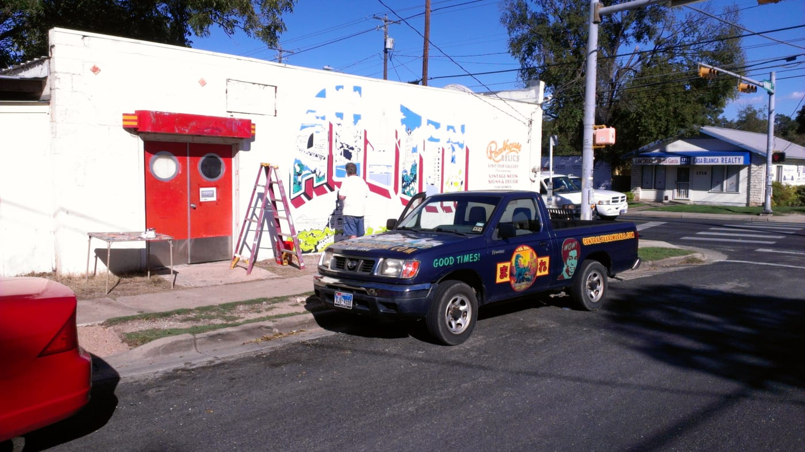
_*Greetings from Austin* (1998) — the artist's best-known landmark mural, and a Sold piece._

> ⚠️ **"Greetings from Austin" is a structural constraint, not just a nice image.** It is *Sold*, and its
> source file is 576×376 — below the local 1500px merch gate. Any "Austin Iconic" merchandise promise is
> currently **unfulfillable** from that artwork.

## WIP Placeholders

The following are **deliberately left as placeholders** rather than filled with invented content:

```text
┌─────────────────────────────────────────────────────┐
│  WIP — STUDIO ADMIN FULL SURFACE SET                │
│  Source: _archive/history/v3.1.0/**/*.jpg (23 files)│
│  Missing: catalog, inquiries, pages, media,         │
│           taxonomies, users, settings, design,      │
│           trash, changelog, dashboard               │
│  Action: inline on request, or host the generated   │
│          index.html as a route                      │
└─────────────────────────────────────────────────────┘

┌─────────────────────────────────────────────────────┐
│  WIP — ARCHITECTURE DIAGRAM                         │
│  No Excalidraw / SVG / draw.io file exists in       │
│  either repo. Only ASCII diagrams in README.md and  │
│  the roadmaps.                                      │
│  Action: author a real diagram of the two-property  │
│          estate + the Fourthwall data flow          │
└─────────────────────────────────────────────────────┘

┌─────────────────────────────────────────────────────┐
│  WIP — MOBILE / RESPONSIVE CAPTURES                 │
│  Desktop-only captures exist. No 390px frame was    │
│  committed for either property.                     │
└─────────────────────────────────────────────────────┘
```

| Flag | Item |
| :--- | :--- |
| **PASS TO CLIENT** | The storefront + studio screens — this is the visual validation they asked for |
| **WIP** | Architecture diagram, admin surface set, mobile frames |
